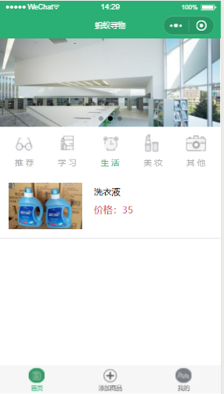
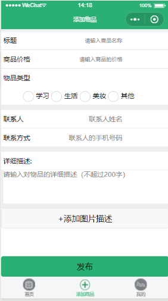
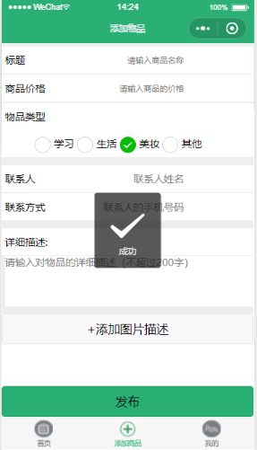
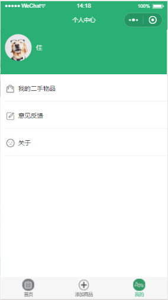
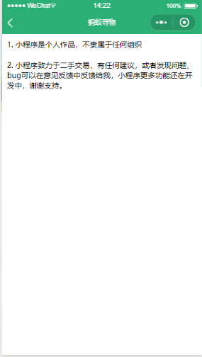
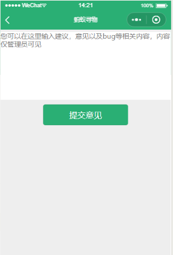
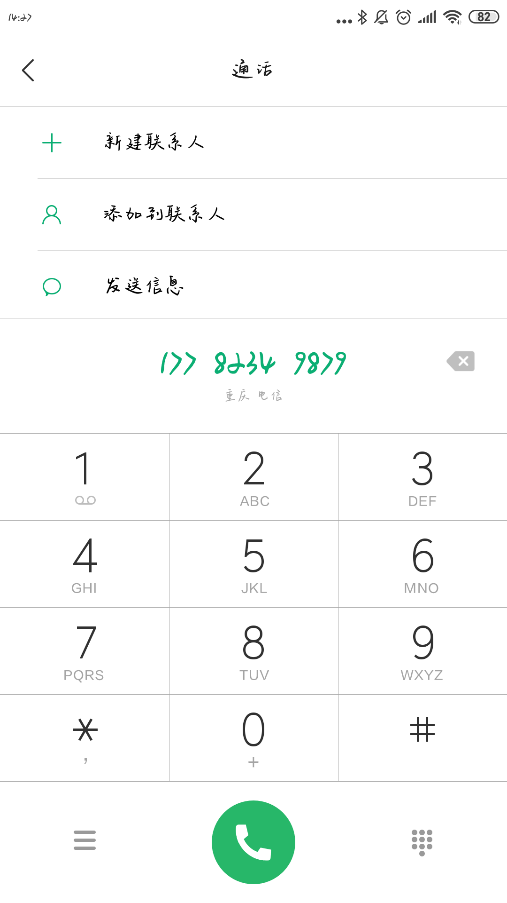



# 2016级项目实训成果展示 

## 《蚂蚁寻物》 - HTML5与移动互联网应用开发

### 项目简介

蚂蚁寻物是一款包含基于地点闲置物品买卖，失物招领的APP。 旨在根据商品地点，方便广大师生对物品的选择。为各大高校的师生提供详细的分类二手物品，可以在线上进行聊天交互，线下进行交易。保障商品的可靠性，减少师生买卖物品地点上的局限性。 用户可以通过失物招领模块找到自己丢失物品或上传捡到的东西，特别是当用户通过校园卡实名注册后，在本人遗失校园卡被人找到时，可以第一时间接收推送。减少了师生寻找丢失物品的时间，避免在校园内毫无目标地寻找自己的东西

### 项目地址
- Github：[https://github.com/weijia0208/project-training](https://github.com/weijia0208/project-training)

### 项目成员

- 姚静（项目经理、UI设计师、开发工程师、测试工程师）
  - Email：[1903123658@qq.com](mailto:1903123658@qq.com) 
  - Github：[https://github.com/yaojingo728](https://github.com/yaojingo728)
- 魏佳（产品经理、UI设计师、开发工程师、测试工程师）
  - Email：[1002475276@qq.com](mailto:1002475276@qq.com)
  - Github：[https://github.com/ZhuoZm](https://github.com/ZhuoZm)
- 杨晓宇（质量专家、UI设计师、测试工程师）
  - Email：[1544329238@qq.com](mailto:1544329238@qq.com)
  - Github：[https://github.com/wangxiulian](https://github.com/yangxiaoyu98)

### 项目截图

